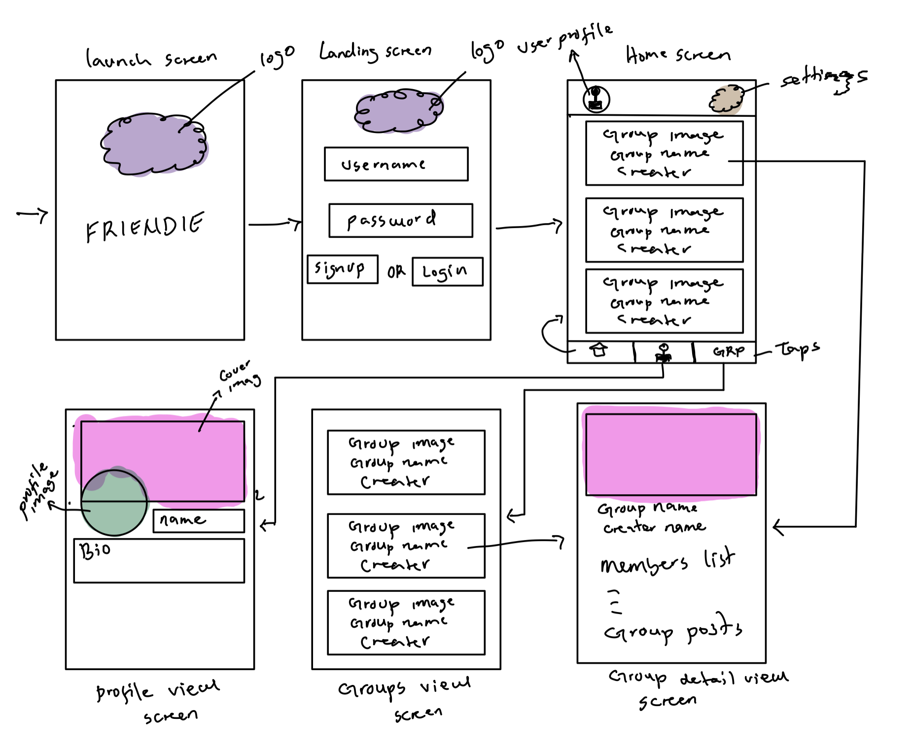

# Friendie

## Table of Contents

1. [Overview](#Overview)
1. [Product Spec](#Product-Spec)
1. [Wireframes](#Wireframes)
1. [Schema](#Schema)

## Overview

We are a group of 5 CS students who will be working together to build the next social networking app dedicated mainly to bring friends and families closer so they can share memorable times together.

### Description

Friendie is a social networking application for your friends or family. You can organise meetings and events with your group. The app will display the places you visited with your friends in a map. You can click on a place on the map and get more details about that place you visited.

### App Evaluation

[Evaluation of your app across the following attributes]

- **Category:** Social
- **Mobile:** Mobile will be used to gain immediate access to the list of friends and list of places visited. It is also essential for getting a description of past visted places.  
- **Story:** Allows friends of a user view visited locations. A user can sign up and add friends, once 2 users become friends, they can create a group on the app and then collaborate with their friends. If users plan an outing, they can add the visited location to the app and have access to a list of all the placeas they have visited together. 
- **Market:** Youths, Students, Friends
- **Habit:** Friends will use this when they want to hangout as a group and need inspiration on where to go. They can view their other friends past hangout spots. 
- **Scope:** 

## Product Spec

### 1. User Stories (Required and Optional)

**Required Must-have Stories**

- Users can create an account, login, and logout.
- Users can view and edit their profile info.
- Users can view all the groups they are in.
- Users can click on a group and look at the all members of that group.
- Users can click on a group and view all the things shared in that group.

**Optional Nice-to-have Stories**

- Users can view places they visited in a map.
- Click on a place on the map and get detailed view of that place.

### 2. Screen Archetypes

- Styled launch screen with logo.
- Landing screen
  - Styled signup and login screens.
  - Users can create an account, and login.
- Home screen
  - Users can view all the groups they are in.
- Detailed Group Screen
  - Users can click on a group and look at the all members of that group.
    Users can click on a group and view all the things shared in that group.
- Profile screen
  - Users can view and edit their profile info.
- Settings screen.
  - Users can logout.
  - They can go to their profile screen from this screen.

### 3. Navigation

**Tab Navigation** (Tab to Screen)

- Home
- Profile
- Groups

**Flow Navigation** (Screen to Screen)

- Landing screen(Sign up or login)
  - Navigates to Home screen upon login success.
  - ...
- Home screen
  - Groups screen
  - User profile screen
- User profile screen
  - Edit user profile screen
- Groups screen
  - Group Detailed view screen
- Group detailed view screen
  - .Edit group screen
  - Add post to a group screen
  - Add users to a group screen.

## Wireframes

A picture of hand sketched wireframe

### [BONUS] Digital Wireframes & Mockups

### [BONUS] Interactive Prototype

## Schema

[This section will be completed in Unit 9]

### Models

- Users
- Groups
- Posts

### Networking

- The signup and login screen will make a network call to Parse to authenticate the user.
- [Create basic snippets for each Parse network request]
- [OPTIONAL: List endpoints if using existing API such as Yelp]
