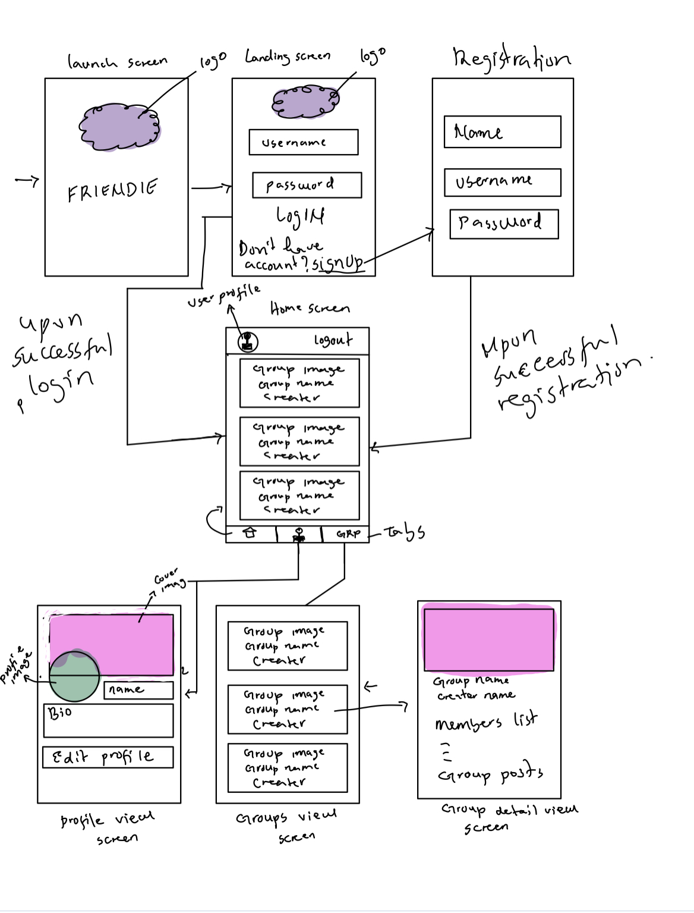
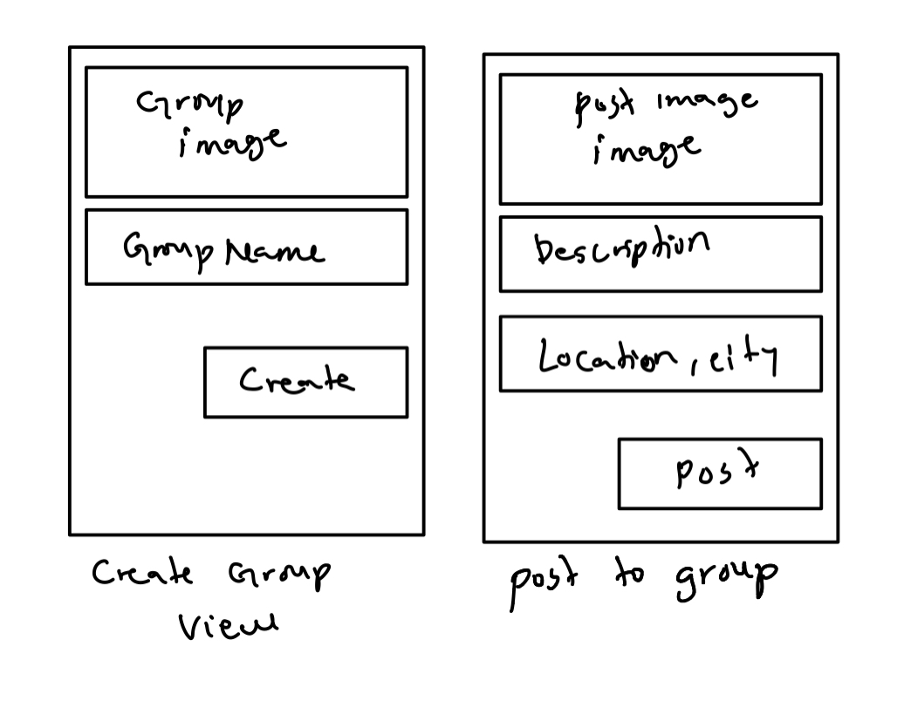

# Friendie

## Table of Contents

1. [Overview](#Overview)
1. [Product Spec](#Product-Spec)
1. [Wireframes](#Wireframes)
1. [Schema](#Schema)

## Overview

We are a group of 5 CS students who will be working together to build the next social networking app dedicated mainly to bring friends and families closer so they can share memorable times together.

### Description

Friendie is a social networking application for your friends or family. You can add friends/family with active accounts to your group. You can organise meetings and events with your group. Anyone who is in the group can post to the group and view the group's content.

### App Evaluation

[Evaluation of your app across the following attributes]

- **Category:** Social
- **Mobile:** Mobile will be used to gain immediate access to the list of friends and list of places visited. It is also essential for getting a description of past visted places.
- **Story:** Allows friends of a user view visited locations. A user can sign up and add friends, once 2 users become friends, they can create a group on the app and then collaborate with their friends. If users plan an outing, they can add the visited location to the app and have access to a list of all the placeas they have visited together.
- **Market:** Youths, Students, Friends
- **Habit:** Friends will use this when they want to hangout as a group and need inspiration on where to go. They can view their other friends past hangout spots.
- **Scope:**

## Product Spec

### 1. User Stories (Required and Optional)

**Required Must-have Stories**

- [x] Users can create an account and login. 
- [x] User can logout.
- [ ] Users can view and edit their profile info.
- [x] User can Create groups.
- [ ] Users can add people to groups.
- [ ] Users can view all the groups they are in.
- [ ] Users can click on a group and look at the all members of that group.
- [ ] Users can click on a group and view all the things shared in that group.

**Optional Nice-to-have Stories**

- [ ] Users can view places they visited in a map.
- [ ] Click on a place on the map and get detailed view of that place.

 
 

### 2. Screen Archetypes

- Styled launch screen with logo.
- Landing screen
  - Styled signup and login screens.
  - Users can create an account, and login.
- Home screen
  - Users can view all the groups they are in.
- Detailed Group Screen
  - Users can click on a group and look at the all members of that group.
    Users can click on a group and view all the things shared in that group.
- Profile screen
  - Users can view and edit their profile info.
- Settings screen.
  - Users can logout.
  - They can go to their profile screen from this screen.

### 3. Navigation

**Tab Navigation** (Tab to Screen)

- Home
- Profile
- Groups

**Flow Navigation** (Screen to Screen)

- Landing screen(Sign up or login)
  - Navigates to Home screen upon login success.
  - ...
- Home screen
  - Groups screen
  - User profile screen
- User profile screen
  - Edit user profile screen
- Groups screen
  - Group Detailed view screen
- Group detailed view screen
  - .Edit group screen
  - Add post to a group screen
  - Add users to a group screen.

## Wireframes

A picture of hand sketched wireframe

### [BONUS] Digital Wireframes & Mockups

### [BONUS] Interactive Prototype

## Schema

[This section will be completed in Unit 9]

### Models

- Users
  - Full Name
  - Username
  - Password
  - coverImage
  - profileImage
- Groups
  - Name
  - GroupImage
  - Author: user
  - GroupSize
  - Members: [users]
  - Posts: [posts]
- Posts
  - Description
  - Image
  - Location

### Networking

- Landing screen
- network call using Parse to log in
- network call using Parse to register a new account
- Home Screen
- (Read/GET) Query all group images
- (Read/GET) Query all group names
- Profile Screen
- (Read/GET) Query logged in user object
- Groups Visual Screen
- (Read/GET) Query all group images, names, etc
- Groups detail view screen
- (Read/GET) Query all members of that group
- (Read/GET) Query the group name
- (Read/GET) Query posts belonging to that group
